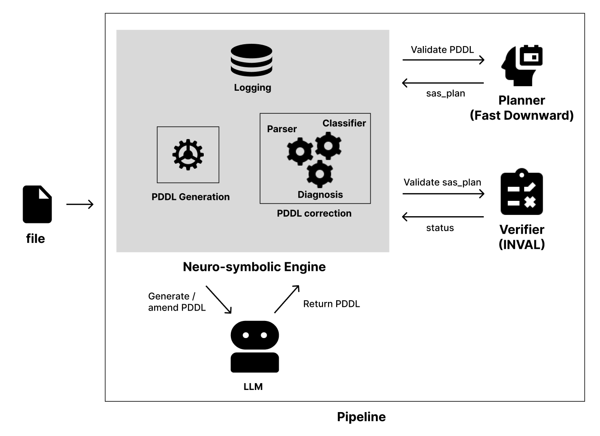

# Neuro-Symbolic Planning Pipeline

This project implements a **neuro-symbolic pipeline** for translating natural language problem descriptions into valid **PDDL (Planning Domain Definition Language)** problem specifications.The system combines **LLM-based generation** with **symbolic validation and verification**, enabling iterative refinement toward syntactically and semantically correct planning problems.

---

## Overview

The pipeline takes a natural language problem description and produces a **validated PDDL problem file** through an iterative generate–validate–refine loop.

### Workflow

1. **Input Processing**
   - A problem description is parsed and preprocessed.
   - The processed input is passed to the LLM.

2. **Initial Generation**
   - The LLM generates an initial PDDL problem:
     - Initial state
     - Goal state

3. **Symbolic Validation**
   - The generated PDDL is validated using *Fast Downward*.
   - Errors (e.g., syntax, missing predicates, inconsistencies) are collected.

4. **Iterative Refinement**
   - Validation errors are summarized and fed back into the LLM.
   - The LLM produces a corrected version of the PDDL.
   - This loop continues:
     - until no errors remain, or
     - a maximum number of iterations is reached

5. **Final Verification**
   - The validated PDDL is further checked using the *INVAL* verifier to ensure correctness.

---

## Key Design Ideas

- **Neuro-symbolic integration**  
  Combines LLM flexibility with formal guarantees from symbolic planners.

- **Self-refinement loop**  
  Uses structured feedback from symbolic validation to iteratively improve outputs.

- **Error-driven correction**  
  Grounds improvements in explicit planner feedback rather than raw generation.

---

## Architecture

  

---

## Related Work

### Initial Problem Generation

The design of the initial generation stage is informed by:

1. *PlanBench*  
2. *TIC: Translate-Infer-Compile for Accurate "Text-to-Plan" using LLMs and Logical Representations*  
3. *Learning Where and When to Reason in Neuro-Symbolic Inference*

### PDDL Correction & Refinement

The iterative correction mechanism draws inspiration from:

1. *PlanBench*  
2. *Chain-of-Thought Prompting Elicits Reasoning in Large Language Models*  
3. *LCoT (Least-to-Most / Layered Chain-of-Thought reasoning)*  
4. *SELF-REFINE: Iterative Refinement with Self-Feedback*

---

## Future Improvements

- Decomposing the generation of the initial draft into a more structured and explicit process that involves information retrival, information derivation and information synthesis
- A more general error logs parser and classifier
